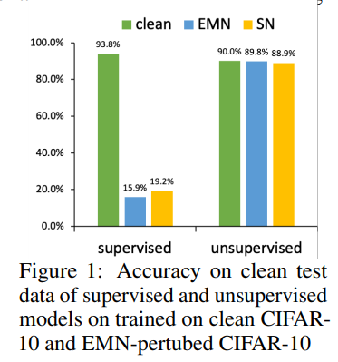
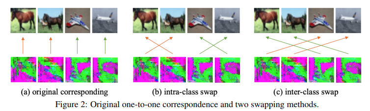
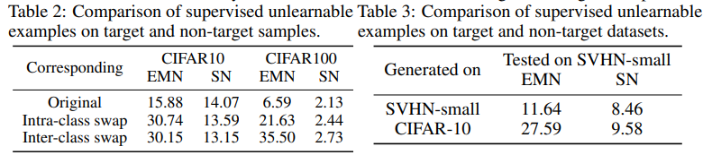

# TRANSFERABLE UNLEARNABLE EXAMPLES

**arkiv**: https://arxiv.org/abs/2210.10114

**GitHub Code**:  https://github.com/renjie3/TUE

## 大致思想：

## 解读：

### 摘要

[Huang etal.](https://openreview.net/forum?id=iAmZUo0DxC0) EMN（Error Minimize Method）方法只能在特定的[训练环境][training setting]和[目标测试集][target dataset]中产生。一旦训练环境或者目标测试机发生改变，扰动效果就会下降。为解决此问题，作者提出[类别分离判别式][Classwise Separabililty Discriminant (CSD)]，通过提升线性可分离性将方法的有效性拓展到其他训练设置和数据集上。

### 1 介绍

([Huang et al., 2020]; [Fowl et al., 2021]; [He et al., 2022])方法通过插入[“快捷”][Shortcut]噪声使样本无法被学习。模型会注意到“Shortcut”的特征而不是原始数据。

现有方法的两个移植性方面的缺点：

1. 训练智能training-wise

   弱训练智能移植性：意味着噪声无法被移植到其他的训练设置上。我们可以用无监督学习（例如对比学习SimCLR）学习EMN-perturbed的数据特征，再在perturb数据集上微调，可以达到和unperturb数据集上差不多的效果。

2. 数据智能data-wise

​		弱数据智能移植性：意味着在目标数据集上生成的噪声被移植到另一个数据集上时效果会降低。所以当新的数据加入时需要在新的数据集上重新跑一次整个算法。

利用Synthetic Noise(SN)

### 2 相关工作

#### Unlearnable Examples

介绍了一[Unlearnable Examples](https://openreview.net/pdf?id=iAmZUo0DxC0)生成噪声的方法。有篇文章指出噪声在特征空间中的线性可分性。

最近的[Unlearnable Contrastive Learning (UCL)](https://arxiv.org/abs/2202.11202)保护数据被无监督对比学习算法利用。

二者都缺少数据智能data-wise移植性（实验中的验证）。

#### Unsupervised Learning

总结了一下流行的对比学习模型。SimCLR、SimSiam、BYOL。

### 3 基础

### 3.1 定义

### 3.2 已有方法的迁移性

#### 3.2.1训练智能移植性

EMN和SN的训练智能迁移性并不好。

#### 3.2.2 数据智能移植性

类间噪声打乱和类内噪声打乱

下图第一个是带目标，后两个分别是类内和类间打乱。

结果：

表内数字代表测试集上的准确率

分别是non-target data sample non-target dataset

## 4 基于类别分类判别的可迁移不可学习性

### 4.1线性分类判别器

可优化线性分类判别器

对每一个类构造扰动中心
$$
c_k=\frac{1}{|\{\delta_i:y_i=k\}|}\sum  _{\{|\delta_i:y_i=k|\}}   \delta_i
$$
于是类内距离：
$$
\boldsymbol{\sigma}_k=\frac{1}{\left|\left\{\boldsymbol{\delta}_i: y_i=k\right\}\right|} \sum_{\left\{\boldsymbol{\delta}_i: y_i=k\right\}} d\left(\boldsymbol{\delta}_i, \boldsymbol{c}_k\right),
$$
这里$d$指欧氏距离

类间距离
$$
d_{i, j}=d\left(\boldsymbol{c}_i, \boldsymbol{c}_j\right)
$$
类内距离小类间距离大

为了提高线性分类性能，提出Classwise Separability Discriminant（CSD，类别分类判别式）
$$
\mathcal{L}_{\mathrm{S}}\left(\left\{\boldsymbol{\delta}_i, y_i\right\}_{i=1}^n\right)=\frac{1}{M} \sum_{i=1}^M \frac{1}{M-1} \sum_{j \neq i}^{M-1}\left(\frac{\boldsymbol{\sigma}_i+\boldsymbol{\sigma}_j}{d_{i, j}}\right)
$$
$\mathcal{L}_S(\{\delta_i,y_i\}_{i=1}^n)$相当于是根据前一步得到的样本噪声$\{\delta_i,y_i\}_{i=1}^n$去算线性分类判别损失。

### 4.2 可迁移Unlearnable Examples

生成噪声公式
$$
\mathop{min} _\theta  \mathop{min} _{\{\delta_i:||\delta_i||_\infty \le\epsilon\}} \sum_{i=1}^{n}\mathcal{L}_{CL}\biggl( f\bigl( \theta,T_1(x_i+\delta_i)\bigr), f\bigl(\theta,T_2(x_i+\delta_i)\bigr)\bigg)+\lambda \mathcal L _S (\{\delta_i,y_i\}_{i=1}^n)
$$
其中$\mathcal{L}_{CL}$是对比学习的损失，$\mathcal{L}_S$是

优化方法
$$
\left\{\begin{array}{l}
\mathrm{S} 1: \theta^{(t)}=\underset{\theta}{\arg \min } \sum_{\boldsymbol{x}_i \in \mathcal{D}_c} \mathcal{L}_{\mathrm{CL}}\left(f\left(\theta, T_1\left(\boldsymbol{x}_i+\boldsymbol{\delta}_i^{(t-1)}\right)\right), f\left(\theta, T_2\left(\boldsymbol{x}_i+\boldsymbol{\delta}_i^{(t-1)}\right)\right)\right) \\
\text { S2 }: \boldsymbol{\delta}_i^{(t)}=\underset{\left\{\boldsymbol{\delta}_i:\left\|\boldsymbol{\delta}_i\right\|_{\infty} \leq \epsilon\right\}}{\arg \min } \mathcal{L}_{\mathrm{CL}}\left(f\left(\theta^{(t)}, T_1\left(\boldsymbol{x}_i+\boldsymbol{\delta}_i\right)\right), f\left(\theta^{(t)}, T_2\left(\boldsymbol{x}_i+\boldsymbol{\delta}_i\right)\right)\right)+\lambda \mathcal{L}_{\mathrm{S}}\left(\left\{\boldsymbol{\delta}_i, y_i\right\}_{i=1}^n\right) .
\end{array}\right.
$$

